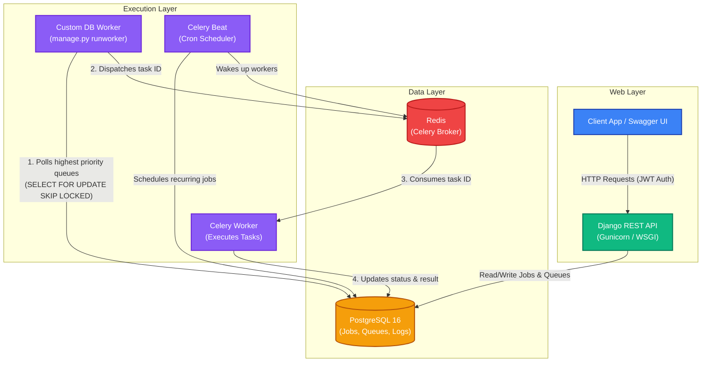

# System Architecture

The following diagram illustrates the high-level architecture of the **Distributed Job Scheduler**. It showcases how the API, database, message broker, and various background workers interact to process jobs asynchronously.

### Component Breakdown
1. **Client / Web Layer**: Users interact with the system via JWT-authenticated API requests to create Projects, Queues, and Jobs.
2. **PostgreSQL**: Acts as the central source of truth. It stores all hierarchical data, job metadata, schedules, and logs. `SELECT FOR UPDATE SKIP LOCKED` ensures job claiming is highly concurrent and atomic.
3. **Custom DB Worker**: A persistent background process that polls PostgreSQL based on queue priority, atomically claims jobs, and pushes their IDs to the Celery broker.
4. **Redis**: The fast, in-memory message broker that queues the actual execution commands for Celery.
5. **Celery Worker**: Consumes the dispatched tasks from Redis, executes the actual job payloads, and writes the `result` and `status` (`completed`, `failed`) back to PostgreSQL.
6. **Celery Beat**: A periodic scheduler that reads from the database schedules and triggers recurring cron jobs automatically.
