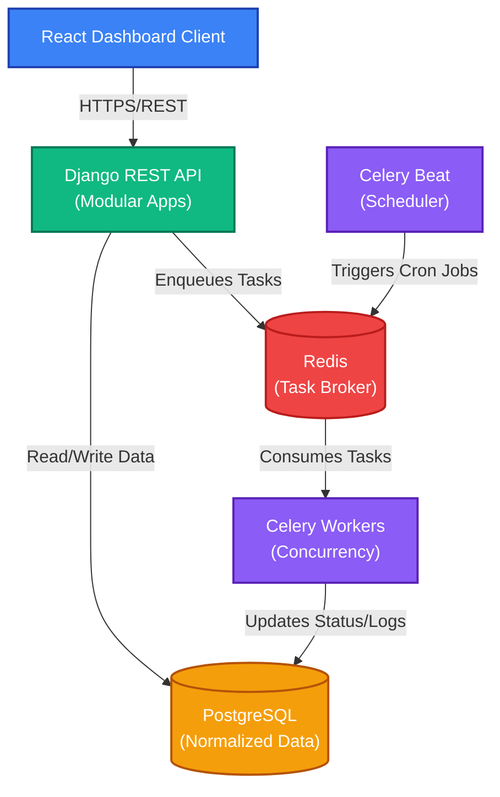

# System Architecture

The following diagram illustrates the high-level architecture of the Distributed Job Scheduler.

### Component Breakdown
1. Client: Users interact with the system via JWT-authenticated API requests to manage jobs, queues, and projects.
2. Django REST API: The core backend application, organized into modular apps (Authentication, Projects, Queues, Jobs, etc.), processing incoming requests.
3. PostgreSQL: The central database storing all hierarchical data, job metadata, schedules, and execution logs.
4. Celery Worker: Consumes and executes the background tasks generated by the system.
5. Celery Beat: A periodic scheduler that triggers recurring cron jobs automatically, feeding them to the Celery Worker.
