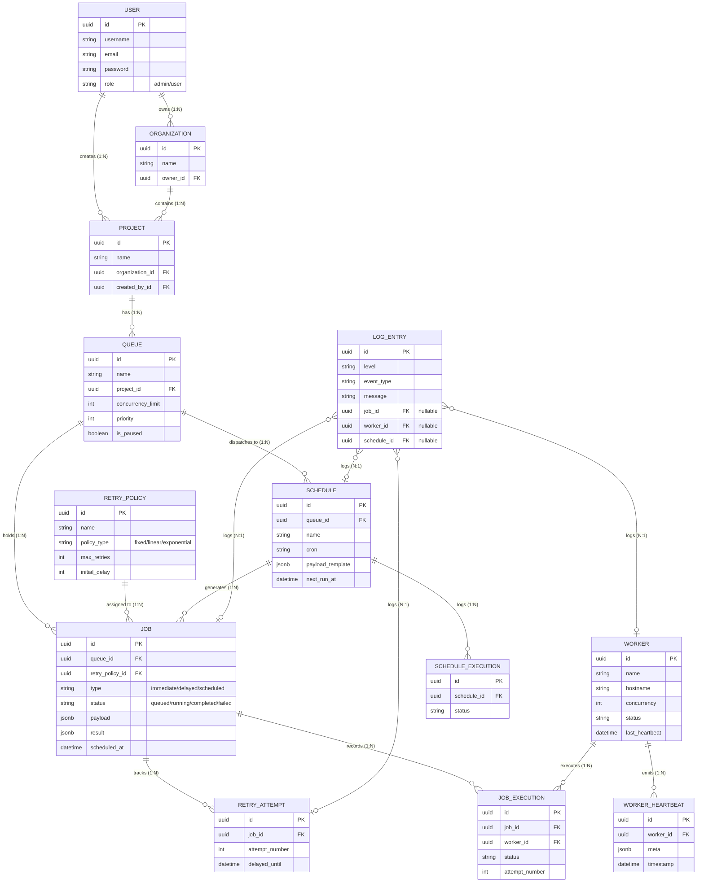

# Database Entity-Relationship Diagram

This document illustrates the data model and the relationships between the core entities in the Distributed Job Scheduler.

### Key Relationships
- Multi-Tenancy: Users own `Organizations`, which contain `Projects`. All `Queues` and `Jobs` sit under a specific project, strictly scoping access based on JWT permissions.
- Job Execution: A `Job` represents the overarching task state, while `JobExecution` instances track every individual attempt a `Worker` makes at executing it.
- Scheduling Engine: A `Schedule` runs periodically (driven by Celery Beat) and dynamically inserts new `Job` instances into its assigned `Queue`.
- Fault Tolerance: If a job fails, the `RetryPolicy` dictates the backoff. A `RetryAttempt` is generated and tracked until the job either succeeds or moves to a Dead Letter state.
- Centralized Auditing: The `LogEntry` table maintains optional foreign keys to `Job`, `Worker`, `Schedule`, and `RetryAttempt` for incredibly deep, interconnected audit trails across the system.
